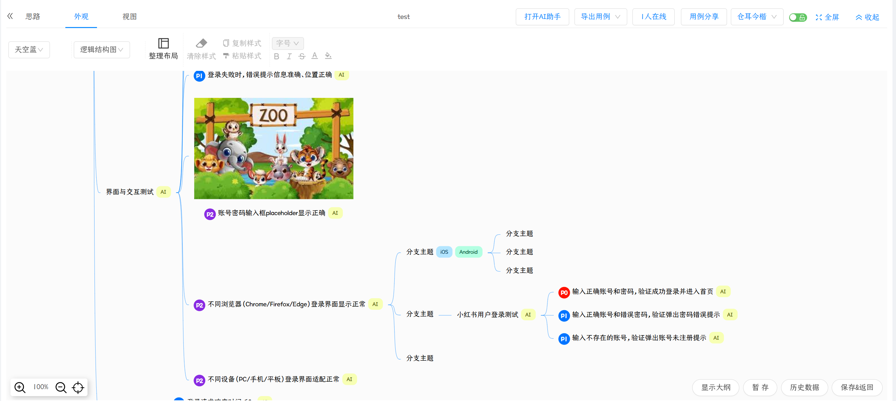

# KCase [](https://github.com/thealert/KCase/actions/workflows/build.yml)

<p align="center">
  
</p>

<p align="center">
  一款支持 <b>脑图式编辑</b> 与 <b>AI 辅助生成</b> 的测试用例管理平台
</p>

<p align="center">
  <a href="#-核心功能">核心功能</a> ·
  <a href="#-架构">架构</a> ·
  <a href="#-快速开始docker-一键部署">快速开始</a> ·
  <a href="#-本地开发">本地开发</a> ·
  <a href="#-项目结构">项目结构</a>
</p>

---

## ✨ 核心功能

| 能力 | 说明 |
| --- | --- |
| 📋 **用例管理** | 列表视图支持状态流转、创建人筛选、快捷操作入口 |
| 🌳 **脑图式编辑** | 节点拆分、标签、优先级标记，适合复杂场景的结构化设计 |
| ▶️ **用例执行** | 实时跟踪通过率、执行进度、节点状态 |
| 🤖 **AI 辅助生成** | 基于当前节点或业务场景自动补充测试点与用例内容 |
| 🕓 **历史备份** | 版本回溯、审计、恢复 |
| 🎨 **多主题** | 浅色 / 深色等多主题切换 |

### 功能预览

#### 1. 用例管理 — 状态流转与快捷操作

<p align="center">
  
</p>

#### 2. 用例编辑 — 脑图式结构化设计

<p align="center">
  
</p>
<p align="center">
  
</p>

#### 3. 用例执行 — 实时进度与通过率

<p align="center">
  
</p>

#### 4. AI 生成用例 — 智能补全测试点

<p align="center">
  
</p>

#### 5. 历史备份 — 版本追溯与恢复

<p align="center">
  
</p>

#### 6. 多主题支持 — 浅色 / 深色切换

<p align="center">
  
</p>

---

## 🏗 架构

<p align="center">
  
</p>

| 分层 | 技术栈 |
| --- | --- |
| 前端 | Umi 2 + React |
| 后端 | Spring Boot 2.1.8 + Maven |
| 存储 | MySQL 5.7 |
| AI 能力 | OpenAI 兼容接口 |

---

## 🚀 快速开始（Docker 一键部署）

> 一条命令启动 `frontend + backend + mysql` 三个服务。

**前置要求**：本机已安装 Docker 与 `docker compose`（macOS/Windows 推荐 Docker Desktop，Linux 安装 Docker Engine + Compose Plugin）。

### 方式一：拉取预构建镜像（推荐，无需克隆仓库）

镜像默认从 Docker Hub 拉取：`docker.io/thealert/kcase-{frontend,backend,mysql}`，同时也发布到 GitHub Container Registry：`ghcr.io/thealert/kcase-{frontend,backend,mysql}`。

```bash
mkdir kcase && cd kcase

# 1. 下载 compose 文件和 .env 模板
curl -O https://raw.githubusercontent.com/thealert/KCase/main/docker/docker-compose.yml
curl -o .env https://raw.githubusercontent.com/thealert/KCase/main/docker/.env.example

# 2. 编辑 .env：必改 MYSQL_ROOT_PASSWORD 和 MYSQL_PASSWORD（二者必须一致）
vim .env

# 3. 拉镜像并启动
docker compose pull
docker compose up -d

# 后续运行
docker compose up -d
```

> 想锁定版本：在 `.env` 中设置 `KCASE_TAG=v1.0.0` 或 `KCASE_TAG=sha-abcdef0`，默认 `latest`。
> 如需使用 GHCR，可在 `.env` 中把 `KCASE_REGISTRY` 改成 `ghcr.io/thealert`，再执行 `docker compose pull`。

### 方式二：源码本地构建（开发者）

```bash
# 1. 克隆并构建前端产物
git clone https://github.com/thealert/KCase.git
cd KCase

# 2. 复制配置模板，并按需修改数据库密码、AI 配置（可选）和端口（可选）
cp docker/.env.example docker/.env

# 3. 启动容器（首次会本地构建镜像）
cd docker && docker compose up --build -d

# 后续运行
docker compose up -d
```

> 如果镜像拉取较慢或超时，建议先配置 Docker 镜像加速地址，再执行启动命令。
> Docker Desktop 可在 `Settings > Docker Engine` 中添加 `registry-mirrors`，Linux 可编辑 `/etc/docker/daemon.json` 后重启 Docker。
>
> ```json
> {
>   "registry-mirrors": [
>     "https://docker.1ms.run",
>     "https://docker.xuanyuan.me"
>   ]
> }
> ```

**默认访问地址**：

- 前端页面： <http://localhost:8443/mycasemind-cms/>
- MySQL 端口： `3308`

---

## 🛠 本地开发

### 环境要求

| 组件 | 版本 |
| --- | --- |
| Node.js | ≥ 12.0.0 <= 16 |
| JDK | 1.8 |
| Maven | 3.x |
| MySQL | 5.7（推荐） |

### 1. 初始化数据库

创建数据库 `mycase_manager`，并执行建表脚本：

```bash
mysql -u root -p mycase_manager < casemind_backend/sql/case-manager.sql
```

### 2. 配置后端

编辑 `casemind_backend/src/main/resources/application-dev.properties`：

```properties
# MySQL 连接（默认 127.0.0.1:3306 / mycase_manager / root）
spring.datasource.username=root
spring.datasource.password=your_password

# AI 能力（兼容 OpenAI 接口协议）
ai.openai.base-url=
ai.openai.api-key=
ai.openai.model-name=
```

### 3. 启动后端

```bash
cd casemind_backend
mvn spring-boot:run
# 或打包后运行
mvn clean package -DskipTests
java -jar target/mycasemind-webapp.jar
```

### 4. 启动前端

```bash
cd casemind_front
npm install
npm start          # 开发模式
# npm run build    # 生产构建
```

---

## 📁 项目结构

```
KCase/
├── casemind_front/      # 前端项目（Umi 2 + React）
├── casemind_backend/    # 后端项目（Spring Boot 2.1.8）
│   └── sql/             # 建表脚本
├── docker/              # Docker 部署配置
└── doc/                 # 截图与架构图
```

---

## 📄 License

This project is licensed under the [Apache License 2.0](LICENSE).

---

## 🙏 致谢

用例编辑基础能力基于 [AgileTC](https://github.com/didi/AgileTC) 项目。
