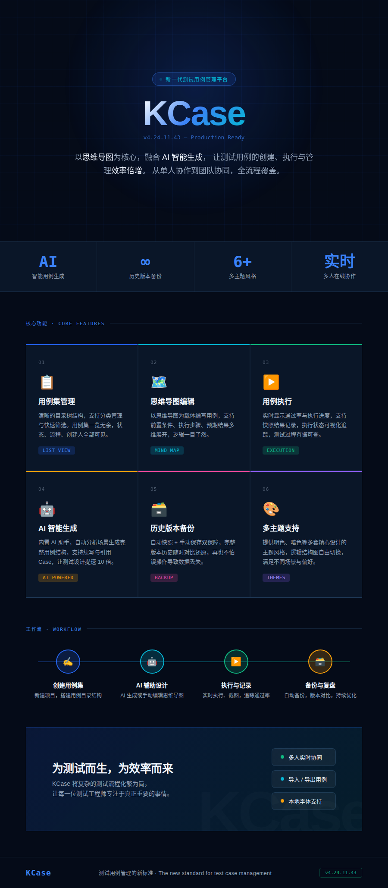

# KCase

<p align="center">
  
</p>

## 项目结构

- `casemind_front`：前端项目，基于 `Umi 2 + React`
- `casemind_backend`：后端项目，基于 `Spring Boot 2.1.8 + Maven`

建议按以下顺序启动：

1. 安装&启动MySQL（建议 5.7） ，创建数据库 mycase_manager，利用sql中的脚本配置对应表。创建表脚本路径：casemind-backend/sql/case-manager.sql
2. 检查并补齐 casemind-backend/src/main/resource `application-dev.properties` 中的数据库账号密码
3. 启动后端 cd casemind-backend && mvn spring-boot:run
4. 启动前端 cd casemind-front && npm install && npm run start
5. ai生成能力（支持openai通用接口调用），配置casemind-backend/src/main/resource `application-dev.properties`下的

ai.openai.base-url=
ai.openai.api-key=
ai.openai.model-name=

## 环境要求

### 前端

- Node.js（`package.json` 中声明为 `>=12.0.0`）
- npm

### 后端

- JDK 1.8
- Maven
- MySQL

## 前端构建与启动

前端目录：

```bash
cd casemind_front
```

安装依赖：

```bash
npm install
```

开发启动：

```bash
npm start
```

生产构建：

```bash
npm run build
```

## 后端构建与启动

后端目录：

```bash
cd casemind_backend
```

开发启动：

```bash
mvn spring-boot:run
```

打包：

```bash
mvn clean package -DskipTests
```

打包后运行：

```bash
java -jar target/mycasemind-webapp.jar
```

## 后端依赖配置

### MySQL

开发环境连接配置位于 `application-dev.properties`：

- 地址：`127.0.0.1:3306`
- 数据库：`mycase_manager`
- 用户名：`root`
- 密码：需要按本地环境填写

用例编辑基础能力基于AgileTC项目